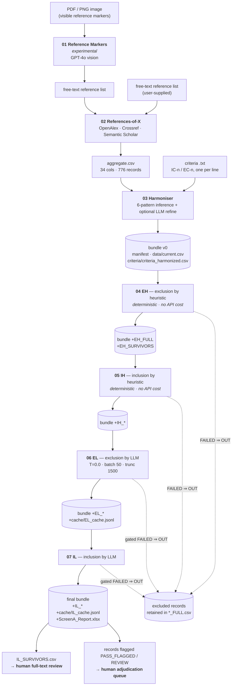
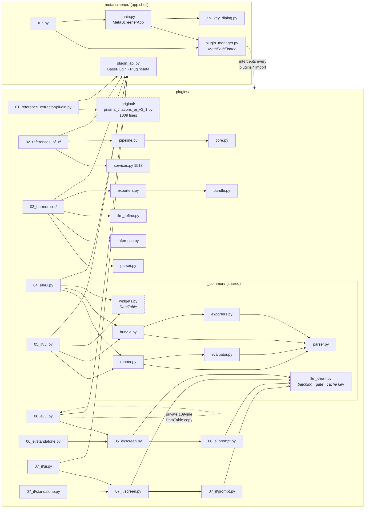

# 01 — Runtime Architecture and Duplication Analysis

*Diagnostic report, Phase 3–4. Read-only analysis.*

---

## Phase 3 — Runtime architecture

### 3.1 Startup path, with import side-effects

```
$ python run.py
```

| Step | File:line | What happens | Side-effect |
|---|---|---|---|
| 1 | `run.py:5` | `import metascreener.plugin_manager` | **Heavy.** Executing this module's body runs `_ensure_metascreener_on_sys_path()` (line 222), computes the plugins root (223), and calls `_install_finder(_root)` (225). The finder installs a synthetic `plugins` module into `sys.modules` and inserts a `_PluginsFinder` at `sys.meta_path[0]`. Prints `PLUGIN LOADER: early meta-path sanitizer INSTALLED` **to stdout**. |
| 2 | `plugin_manager.py:45-56` | `_ensure_metascreener_on_sys_path()` | Mutates `sys.path` — inserts `sys._MEIPASS` (frozen) and the project root at position 0. Then `import metascreener` inside a bare `try/except Exception: pass` (55-56), so an import failure here is invisible. |
| 3 | `plugin_manager.py:186-195` | `_install_finder` | `sys.modules["plugins"] = ModuleType("plugins")` — a **synthetic** module with only `__path__` set. **Consequence: `plugins/__init__.py` is never executed** (verified: the loaded module has no `__file__` and no `__spec__`). |
| 4 | `run.py:6` | `from metascreener.main import MetaScreenerApp` | Imports `tkinter`, `tkinter.ttk`, `.plugin_manager` (already cached), `.api_key_dialog`. No further side-effects. |
| 5 | `run.py:9` `main()` | `MetaScreenerApp()` → `tk.Tk.__init__` | Creates the root window (1200×820, min 1020×720). Requires a display. |
| 6 | `main.py:55-59` | `_load_env_file(project_root/".env")` | Reads `.env` and injects `KEY=VALUE` pairs into `os.environ`, **but only for keys not already set**. Wrapped in `except Exception: pass` (29-30). |
| 7 | `main.py:62` | `_prompt_api_key_always()` | **Always** shows the modal `ApiKeyDialog`, even when a valid key is already in the environment. If the user cancels, `self.after(0, self.destroy)` and `__init__` returns early — the notebook is never built. |
| 8 | `main.py:67-68` | `ttk.Notebook` created and packed | |
| 9 | `main.py:71` → `_load_plugins()` → `plugin_manager.discover(self)` | Prints `PLUGIN LOADER: meta-path sanitizer ACTIVE`, re-runs `_ensure_metascreener_on_sys_path`, re-installs the finder (idempotent), then iterates `sorted(root.iterdir())` and `importlib.import_module("plugins.<dir>.plugin")` for every directory containing a `plugin.py`. | **Import order is `sorted()` over directory names**, which is why the directories are numbered `01_`…`07_`. Each `plugin.py` import pulls in that plugin's whole module graph — for EL/IL that is `prompt` → `screen` → `_common.llm_client` → `ui` → `standalone`, executed in a deliberately fragile order dictated by a circular dependency (documented in `06_el/plugin.py:48-53`). |
| 10 | `main.py:122-200` | Entrypoint resolution per plugin, four strategies tried in order | See §3.3. Every failure is caught and `print()`ed to stdout, then the loop moves on — **a plugin that fails to build its tab produces a console line and a missing tab, with no GUI-visible error.** |
| 11 | `main.py:200` | `self.nb.add(frame, text=tab_title)` | |

Two dead paths worth naming:

- `main.py:70` sets `self._plugins = []` and **nothing ever appends to it.** Therefore
  `_on_tab_changed` (202-205) and `_on_close` (207-213) iterate an always-empty list, and
  the `BasePlugin.on_select()` / `on_close()` lifecycle hooks declared in
  `plugin_api.py:24-30` are **never called**. Every plugin's `on_close` (e.g.
  `06_el/plugin.py:113`, `07_il/plugin.py:134`, `03_harmoniser/plugin.py:54`) is dead code,
  as are Plugin 02's `on_unload` / `on_hide` / `on_show` (`02_references_of_x/plugin.py:53-88`).
  Practical effect: worker threads and open modals are not cooperatively cancelled at exit.
- `main.py:9` imports `discover` at module scope and `main.py:94` imports it again inside
  `_load_plugins`. The module-scope import is unused.

### 3.2 `metascreener/plugin_manager.py` — the custom import machinery

#### What it does

At import time (`plugin_manager.py:222-225`) it installs `_PluginsFinder`, a combined
`MetaPathFinder` + `Loader`, at `sys.meta_path[0]`. That finder claims every import whose
dotted name is `plugins` or begins with `plugins.` (`find_spec`, lines 97-153). Its
`exec_module` (159-184) then:

1. reads the file as UTF-8 with `errors="ignore"` (`_read_text`, 73-77);
2. strips a leading BOM and **deletes every line whose stripped form starts with
   `from __future__ import` and contains `annotations`, wherever it occurs in the file**
   (`_sanitize`, 60-71);
3. compiles the result with `dont_inherit=True, flags=__future__.annotations.compiler_flag`
   — i.e. re-applies PEP 563 semantics that step 2 just removed;
4. fixes up `module.__package__`;
5. `exec()`s the code object into the module namespace.

#### What problem it is supposed to solve

The docstring (lines 9-18) says: *"Treats 'plugins/' as a data directory (bundled with
`--add-data "plugins;plugins"`)."* Both spec files do exactly that —
`metaScreener.spec:5`: `datas = [('plugins', 'plugins')]`. In a PyInstaller **one-file**
build, `datas` are unpacked to `sys._MEIPASS` at runtime and are *not* importable modules,
so a naive `import plugins.06_el.plugin` would fail. The finder makes the data directory
importable again.

#### Verified assessment

I tested each claim offline.

**(a) The finder is not required in the source tree.** With the finder *not* installed and
the project root on `sys.path`, stock `importlib.import_module` loads all ten plugin
modules cleanly — including the numeric-prefixed packages, which are only unimportable via
the `import` *statement*, not via `import_module`:

```
OK   plugins._common.llm_client       OK   plugins.06_el.plugin
OK   plugins.06_el.screen             OK   plugins.03_harmoniser.plugin
OK   plugins.06_el.prompt             OK   plugins.01_reference_extractor.plugin
OK   plugins.04_eh.plugin             OK   plugins.02_references_of_x.plugin
OK   plugins.05_ih.plugin             OK   plugins.07_il.plugin
```

**(b) It is probably not required frozen either.** `_ensure_metascreener_on_sys_path()`
(lines 45-52) already inserts `sys._MEIPASS` at `sys.path[0]`. Once `_MEIPASS` is on
`sys.path`, `<_MEIPASS>/plugins/` is an ordinary package directory with an `__init__.py`
and the standard `FileFinder` can import it. I cannot *prove* this without producing a
frozen build (see Open Questions), but the mechanism is the standard one and no PyInstaller
limitation blocks it.

**(c) What is lost.** All verified by direct measurement:

| Loss | Evidence |
|---|---|
| **Bytecode caching** | `plugins._common.parser.__spec__.cached is None`. Nothing is written to or read from `__pycache__` for `plugins.*`. All 15,548 lines of plugin source are re-read and re-compiled on **every** launch. (The `__pycache__` dirs present under `plugins/` were produced by pytest's own collection, not by the app.) |
| **`__file__`** | `hasattr(plugins._common.parser, "__file__") == False`. Any plugin that does `Path(__file__).parent / "template.txt"` raises `NameError`. Currently **zero** plugin modules reference `__file__`, so nothing breaks today — but this is an undocumented hard constraint on all future plugin authors, and it contradicts `README.md:360-370`, which invites third parties to write plugins. |
| **`inspect` / source introspection** | `inspect.getsource(mod)` raises `TypeError: <module 'plugins._common.parser'> is a built-in module`, because `spec.has_location` is `False`. Debuggers, `pdb` `list`, and IDE "go to definition at runtime" all degrade. |
| **Line-number fidelity** | Because `_sanitize` *deletes* the `from __future__` line before compiling, every line below it shifts by one. Measured: `plugins.06_el.screen.run_el_screen` is at disk line **335**, runtime `co_firstlineno` **334**. Same −1 shift in `07_il/screen.py`, `_common/llm_client.py`, and every other module carrying that import. `_common/parser.py`, which has no `__future__` import, shows shift 0. **Every traceback, breakpoint, and coverage line number in the affected files is off by one.** |
| **Static analysis** | `mypy`, `pyright`, and `flake8` see `plugins/` as ordinary source (they never run the loader), so they see the *unsanitised* file — the one with the `__future__` import. Analyser and runtime therefore disagree about the source of every affected module. |
| **`plugins/__init__.py` never runs** | The synthetic `ModuleType` installed at line 189-191 pre-empts it. Today the file is only comments, so nothing is lost; the moment anyone puts a constant or a registration hook there, it will work under pytest and silently not work in the app. |

**(d) Can the sanitiser corrupt source? Yes — demonstrated.** `_sanitize` is line-oriented
and completely string-literal-blind. Tested:

| Input | Result |
|---|---|
| `"""Doc.\nfrom __future__ import annotations\nend."""` | Line silently deleted **from inside the docstring**. Module still compiles; documentation is altered. |
| `S = """\nfrom __future__ import annotations\n"""` then `len(S)` | `len(S)` becomes **1** instead of 34. **Silent semantic corruption of a string literal.** |
| `from __future__ import annotations, division` | Whole line dropped — `division` is lost too. (No-op on Python 3, but the pattern generalises to any future feature.) |
| `  # from __future__ import annotations` | Correctly preserved (the stripped line starts with `#`). |

No file in the repo currently triggers this. It is a latent trap that will fire the first
time someone writes a plugin that embeds Python source in a string — a prompt template, a
code generator, a test fixture. Nothing detects it: the corrupted module still compiles.

**(e) Missing `__init__.py`.** `find_spec` handles it (lines 113-122, 141-142) by
synthesising a namespace-like package whose `exec_module` just sets `__path__` and a
fictitious `__file__` pointing at a non-existent `__init__.py` (line 165). It works, but the
fictitious `__file__` is a lie that would confuse anything reading it. Every plugin
directory in the repo *does* have an `__init__.py`, so this branch is untested in practice.

**(f) Failure-mode summary.** The finder is inserted at `sys.meta_path[0]` and claims the
entire `plugins.` namespace unconditionally. If any third-party package were ever named
`plugins` (a plausible generic name), it would be shadowed silently. `find_spec` returns
`None` on a miss, so a genuinely absent module still raises `ModuleNotFoundError` normally.

#### Verdict: **replace**, in two steps

1. **Now (before the paper lands): wrap in tests, do not touch behaviour.** Add a test that
   asserts `plugins/__init__.py` executes, one that asserts `_sanitize` does not alter a
   string literal (it currently does — the test would document the defect as a known
   `xfail`), and one that asserts each plugin module's `co_firstlineno` matches its disk
   line. Effort: ~2 hours. This makes the removal safe later.
2. **Then: delete the finder.** Replace `discover()` with roughly twenty lines: put the
   plugins root on `sys.path` (frozen: `sys._MEIPASS`; dev: project root), then
   `importlib.import_module(f"plugins.{name}.plugin")` for each directory. Remove `_sanitize`
   entirely — `compile()` handles `from __future__ import annotations` in the source
   perfectly well, which is why the strip-then-re-add-the-flag dance is redundant. Verify
   with one PyInstaller one-file build on Windows. Effort: ~half a day including the frozen
   verification.

   *Why not "keep"?* The finder costs correct line numbers, `__file__`, `inspect`, and
   bytecode caching, and carries a latent source-corruption bug, in exchange for solving a
   problem that stock `importlib` plus the `sys.path` insertion the module already performs
   appears to solve on its own.

**Related dead artefact.** `hook-plugins.py` calls
`collect_submodules("plugins")` to build `hiddenimports`. Both spec files set
`hookspath=[]` (`metaScreener.spec:25`, `metaScreener-console.spec:25`), so **PyInstaller
never loads this hook.** It has no effect on either build.

### 3.3 The plugin contract, and compliance

`metascreener/plugin_api.py` (30 lines) declares the *nominal* contract:

```python
@dataclass
class PluginMeta:  id: str; title: str; version: str = "0.1.0"

class BasePlugin:
    def __init__(self, app, meta: PluginMeta)
    def build_tab(self, parent: ttk.Notebook) -> tk.Frame   # raises NotImplementedError
    def on_select(self): ...      # "Called when the tab becomes active."
    def on_close(self): ...       # "Called when the hub is closing."
```

The *effective* contract is what `main.py:_load_plugins` actually probes, which is much
looser. In order:

1. module-level `build_tab(nb, app=…, meta=…)`, degrading to `(nb, app=…)` then `(nb)`;
2. a module attribute named exactly `Plugin`, constructed `(app, meta)` → `(app)` → `()`;
3. a module attribute named exactly `make_plugin`, same argument degradation;
4. **fallback:** the first class in `vars(module)` that is not named `baseplugin`, is not
   marked `IS_ABSTRACT`, and has a `build_tab` attribute.

The tab label comes from `TAB_TITLE` on the module, then on the instance, then a
`tab_title()` method, else the literal `"Plugin"`.

| Plugin | `TAB_TITLE` | Entry point present | Path taken | Deviation |
|---|---|---|---|---|
| 01 `reference_extractor` | `plugin.py:4` | `create_plugin(app)` + class `ReferenceExtractorEmbedded(BasePlugin)` | **Strategy 4** (fallback) | `create_plugin` is **never called** — the manager looks for `make_plugin`, not `create_plugin`. Loads only because the fallback happens to find the right class. No `PLUGIN_ID`/`PLUGIN_VERSION`. |
| 02 `references_of_x` | `plugin.py:21` | `create_plugin(app)` + class `RefXPlugin(BasePlugin)` | **Strategy 4** | Same dead `create_plugin`. Additionally defines `on_unload`/`on_hide`/`on_show`, none of which exist in the contract *or* are ever called. |
| 03 `harmoniser` | `plugin.py:17` | `create_plugin(app)` + class `HarmoniserPlugin(BasePlugin)` | **Strategy 4** | Same dead `create_plugin`. |
| 04 `eh` | imported from `.ui` into module namespace (`plugin.py:40`) | class `Plugin(BasePlugin)` | Strategy 2 | Compliant. `PluginMeta` version hardcoded `"2.2.1"` at `plugin.py:50` — no module constant. |
| 05 `ih` | imported from `.ui` | class `Plugin(BasePlugin)` | Strategy 2 | Compliant. |
| 06 `el` | `plugin.py:33` | class `Plugin(BasePlugin)` | Strategy 2 | Compliant. |
| 07 `il` | `plugin.py:40` | class `Plugin(BasePlugin)` | Strategy 2 | Compliant. |

Systematic deviations:

- **Three of seven plugins expose `create_plugin`, which the loader does not recognise.**
  They work only via the untyped fallback scan. Renaming `create_plugin` → `make_plugin`
  (three lines) would move them onto a supported path.
- **`on_select` and `on_close` are declared in the contract and never invoked** (see §3.1).
  Of the seven plugins, four implement `on_close`; all four are dead.
- The fallback scan depends on `vars()` insertion order and on `ReferencesOfXView` /
  `HarmoniserView` not having a `build_tab` attribute. I verified neither view class defines
  one, so the scan currently picks the right class in all three cases — by luck, not by
  design. Adding a `build_tab` method to a View class would silently break tab loading.
- `README.md:362-367` documents the extension contract as "`build_tab(parent)` **or** a
  `BasePlugin` subclass with `build_tab`, plus `TAB_TITLE`". That is accurate for what the
  loader accepts, but it does not mention that the plugin will be loaded with no `__file__`
  and no bytecode cache (§3.2).

### 3.4 Data flow, stage by stage

| # | Stage | Input artefact | Output artefact | What mutates | What accumulates |
|---|---|---|---|---|---|
| 01 | Reference Markers | PDF/PNG image | Free-text reference list (clipboard / file) | — | Nothing; stands outside the bundle chain. |
| 02 | References-of-X | Free-text reference list | `*_aggregate.csv` (34 columns, one row per resolved record) | Adds resolved bibliographic fields, provenance, per-source hit flags | Nothing; produces the corpus that Plugin 03 ingests. |
| 03 | Harmoniser | Criteria `.txt` + aggregate `.csv` | **`ScreenA_Bundle_*.zip`** — the first bundle | Creates everything | `manifest.json`, `data/current.csv`, `data/input_errors.csv` (conditional), `criteria/criteria_harmonized.{csv,txt}`, `criteria/criteria_source.txt` |
| 04 | EH | bundle | bundle | `data/current.csv` ← EH survivors | `+ reports/EH_FULL.csv`, `+ reports/EH_SURVIVORS.csv`; `manifest.pipeline.{stages,history}` appended |
| 05 | IH | bundle | bundle | `data/current.csv` ← IH survivors | `+ reports/IH_FULL.csv`, `+ reports/IH_SURVIVORS.csv` |
| 06 | EL | bundle | bundle | `data/current.csv` ← EL survivors; `data/input_errors.csv` **overwritten or removed** (see below) | `+ reports/EL_FULL.csv`, `+ reports/EL_SURVIVORS.csv`, `+ cache/EL_cache.jsonl`; `manifest.updated_at` |
| 07 | IL | bundle | bundle (terminal) | `data/current.csv` ← IL survivors | `+ reports/IL_FULL.csv`, `+ reports/IL_SURVIVORS.csv`, `+ cache/IL_cache.jsonl`, `+ reports/ScreenA_Report.xlsx` |

`data/current.csv` is the only mutating artefact — it is monotonically narrowed and always
carries the **original 34-column schema** with no stage columns. All per-stage decision
detail lives in the `reports/*_FULL.csv` files, which add five columns for EH/IH
(`{stage}_outcome`, `_failed_ids`, `_missing_ids`, `_met_ids`, `_reason_summary`) and seven
for EL/IL (the same minus `_reason_summary`'s position, plus `_uncertain_ids` and
`_evidence_json`). Verified against `tests/golden/el_filtered_v3.1.0.csv` header.

#### The bundle ZIP, precisely

```
ScreenA_Bundle/                       ← root prefix; readers also accept no prefix
├── manifest.json                     written: 03_harmoniser/bundle.py:130
│                                     rewritten: _common/bundle.py:235 (EH/IH),
│                                                06_el/ui.py:1016 & 07_il/ui.py (EL/IL)
├── data/
│   ├── current.csv                   the canonical narrowing record table
│   └── input_errors.csv              conditional; three incompatible schemas (see below)
├── criteria/
│   ├── criteria_harmonized.csv       11 columns: stage,id,type,scope,label,operator,
│   │                                 target,what,threshold,enabled,source_text
│   ├── criteria_harmonized.txt       pipe-table human view
│   └── criteria_source.txt           the researcher's raw prose input
├── reports/
│   ├── EH_FULL.csv  EH_SURVIVORS.csv
│   ├── IH_FULL.csv  IH_SURVIVORS.csv
│   ├── EL_FULL.csv  EL_SURVIVORS.csv
│   ├── IL_FULL.csv  IL_SURVIVORS.csv
│   └── ScreenA_Report.xlsx           cross-stage workbook, written by IL only
└── cache/
    ├── EL_cache.jsonl                one JSON object per line: {"key": sha256, "val": {...}}
    └── IL_cache.jsonl
```

`manifest.json` from Plugin 03 (`03_harmoniser/exporters.py:198-227`):
`bundle_schema: "screenA_bundle_v1"`, `created_at`, `created_by: "harmoniser"`,
`inputs.{aggregate_filename, criteria_filename, criteria_kind}`, `aggregate.{columns,
id_column_guess, expected_columns, rows_total_read, rows_valid_written,
rows_invalid_skipped}`, `criteria.{rows_total, rows_by_stage, enabled_by_stage}`,
`pipeline_state.{stages, history}`, `warnings`, `criteria_source_preview`, and `sha256`.

#### The SHA-256 integrity check — as actually implemented

**Writing.** `03_harmoniser/bundle.py:122-128` hashes exactly two (or three) files —
`data/current.csv`, `criteria/criteria_harmonized.csv`, and `data/input_errors.csv` if
present — and stores them under `manifest["sha256"]` as `{relative_path: hexdigest}`.
`_common/bundle.py:208-215` (EH/IH) refreshes that map for the four files it overwrites.

**Reading.** `04_eh/ui.py:406-417` and `05_ih/ui.py:406-417` recompute the digests of
`data/current.csv` and `criteria/criteria_harmonized.csv` and compare. On mismatch they
append `"[bundle] sha256 mismatch for … (warn only)"` to a warnings list. **It is warn-only:
the run proceeds.**

**Three material gaps, all verified:**

1. **Plugins 06 (EL) and 07 (IL) never touch SHA-256 at all.** Measured: the string `sha`
   appears **zero** times in `06_el/ui.py`, `07_il/ui.py`, `06_el/standalone.py`,
   `07_il/standalone.py`. They neither verify on load nor refresh on export. Since both
   *do* overwrite `data/current.csv` (`06_el/ui.py:1028`), the bundle that emerges from EL
   carries a `manifest.sha256["data/current.csv"]` digest that **no longer matches the file
   it names** — the manifest actively asserts something false. Nothing downstream notices,
   because IL does not check either.
   This directly contradicts `README.md:95`: *"Bundles are integrity-verified using SHA-256
   hashes at ingestion and export. Any modification to the record set or configuration
   between stages is detectable."* That is true for stages 04–05 and false for 06–07 — the
   two stages that carry the LLM decisions.
2. **Nothing is signed or chained.** The digests live in the same file they describe, so an
   editor of the bundle recomputes them trivially. This is a corruption detector, not a
   tamper detector, and the README's "detectable" wording overstates it.
3. **The manifest carries two divergent stage maps.** Plugin 03 writes
   `pipeline_state.stages`; `_common/bundle.py:184-198` (EH/IH) reads and writes
   `pipeline.stages` — a *different key* it creates from scratch; EL/IL's `_set_stage`
   (`06_el/ui.py:987-995`) updates whichever of the two exists. A completed pipeline
   therefore ends up with `pipeline_state.stages` claiming EH/IH `not_run` while
   `pipeline.stages` says `done`. `04_eh/ui.py:375` reads `pipeline`, so the EH tab
   displays `EH=unknown` when loading a fresh Harmoniser bundle.

#### The `input_errors.csv` schema fracture — audit-trail data loss

The file that records *which citations were dropped as malformed* is written with **three
mutually incompatible schemas**:

| Writer | Columns |
|---|---|
| `03_harmoniser/exporters.py:160-166` | `record_number, reason, observed_len, expected_len, raw` |
| `_common/exporters.py:45` (EH/IH) and `_common/bundle.py:177` | `record_index_ex_header, reason, raw_record` |
| `06_el/ui.py:1053` and `07_il/ui.py` | `reason, row_json` |

The only reader, `_common/parser.py:318-338` `_load_input_errors_from_text`, expects the
second schema and requires `int(record_index_ex_header) > 0`. Fed the Harmoniser's file it
returns an empty list — verified directly:

```
Harmoniser-written input_errors.csv, read back by the EH/IH loader:  rows recovered: []
Own-schema round trip:                                    [(5, 'bad_column_count', 'a,b')]
```

So every citation the Harmoniser drops for a wrong column count has its record silently
discarded at the very first pipeline hop; `04_eh/ui.py:460` then reports
`"Imported previous input_errors: data/input_errors.csv (0 rows)"`.

Worse at the EL/IL end: `06_el/ui.py:1003` puts `data/input_errors.csv` in `skip_exact`, so
it is **never copied forward from the input bundle**, and it is only re-written when EL
itself skipped rows (line 1051). A bundle that reaches EL carrying upstream input errors
comes out with the file **deleted**. In a screening tool, a silently dropped citation with
its provenance also deleted is a scientific-integrity defect, not a cosmetic one.

### 3.5 Diagrams

#### Pipeline



#### Module dependency graph



Note the dashed `widgets.py`: its own docstring (`_common/widgets.py:7`) says *"shared Tk
widgets for EH/IH/EL/IL plugins"*, but only `04_eh/ui.py:99` and `05_ih/ui.py:99` import it.
EL and IL each carry their own 109-line `DataTable` (`06_el/ui.py:66`, `07_il/ui.py:73`),
byte-identical to each other and 60 diff-lines away from the shared 73-line version.

---

## Phase 4 — Duplication analysis

### 4.1 Method

Two measurements per file pair:

- **raw ±** — lines emitted by `difflib.unified_diff(..., n=0)` on the files as they are.
- **norm ±** — the same after normalising away stage identity: `EL`/`IL`, `EH`/`IH`,
  `el_`/`il_`, `eh_`/`ih_`, `06_el`/`07_il`, `04_eh`/`05_ih`, `ELView`/`ILView`,
  `run_el_screen`/`run_il_screen`, and the words exclusion/inclusion, exclude/include —
  all mapped to neutral tokens. What survives is **structural** difference.
- **dup %** — `SequenceMatcher` matching-block ratio over the normalised line lists,
  expressed against the larger (B-side) file.

### 4.2 Results — every file pair in the twinned directories

| File pair | A lines | B lines | raw ± | **structurally differing lines** | dup % |
|---|---:|---:|---:|---:|---:|
| `04_eh/__init__.py` ↔ `05_ih/__init__.py` | 2 | 2 | 0 | **0** | 100.0% |
| `04_eh/ui.py` ↔ `05_ih/ui.py` | 877 | 877 | 100 | **20** | **98.9%** |
| `04_eh/plugin.py` ↔ `05_ih/plugin.py` | 66 | 66 | 22 | **12** | 90.9% |
| `06_el/__init__.py` ↔ `07_il/__init__.py` | 2 | 2 | 0 | **0** | 100.0% |
| `06_el/screen.py` ↔ `07_il/screen.py` | 631 | 633 | 90 | **36** | **97.0%** |
| `06_el/prompt.py` ↔ `07_il/prompt.py` | 69 | 69 | 10 | **8** | 94.2% |
| `06_el/standalone.py` ↔ `07_il/standalone.py` | 541 | 542 | 95 | **69** | 93.5% |
| `06_el/plugin.py` ↔ `07_il/plugin.py` | 119 | 140 | 63 | **45** | 76.4% |
| `06_el/ui.py` ↔ `07_il/ui.py` | 1066 | 1314 | 428 | **340** | 77.6% |

**The brief's preliminary figures are confirmed and slightly understated.**
`04_eh/ui.py` vs `05_ih/ui.py` differs by **20 structural lines out of 877** (the brief said
16; the difference is that my normaliser leaves the "Commit 7 / Commit 8" comment and one
docstring-punctuation variation in). `06_el/screen.py` vs `07_il/screen.py` differs by
**36 lines out of ~632** (brief: 37 — agreement to within one line).

### 4.3 What actually differs, pair by pair

**`04_eh/ui.py` ↔ `05_ih/ui.py` — 20 lines.** Nothing but identity. The entire delta is:
the `TAB_TITLE` string; the name `_load_criteria_eh_from_text` → `_ih_`; four
`stage="EH"` → `stage="IH"` keyword arguments passed to already-shared `_common` functions;
the class name `EHView` → `IHView`; ten user-visible strings ("Run EH", "EH Criteria
(read-only)", "EH Full report", dialog titles, default filenames
`ScreenA_Bundle_EH_*.zip`); the five report column names `eh_*` → `ih_*`; and one stale
comment referencing a different commit number. **There is zero behavioural logic in these
877 lines that differs between the two stages** — the two genuine EH/IH behavioural
differences already live, correctly, in `_common/runner.py:146-172`.

**`04_eh/plugin.py` ↔ `05_ih/plugin.py` — 12 lines.** Docstring, three re-export names, the
`PluginMeta` id string, and the hardcoded version (`"2.2.1"` vs the IH equivalent).

**`06_el/screen.py` ↔ `07_il/screen.py` — 36 lines.** Three groups:
- *Identity* (~28 lines): docstrings, `stage_filter="EL"`→`"IL"`, `stage="EL"`→`"IL"` in the
  `run_m1_llm_for_criterion` call, log prefixes `[EL]`→`[IL]`, and the seven output column
  names `el_*` → `il_*`.
- *Vocabulary* (5 lines): `OUTCOMES = ("OUT","PASS_CLEAN","PASS_FLAGGED")` vs
  `("OUT","PASS_CLEAN","REVIEW")`, and the two places that emit the third label. **This is a
  real divergence, not cosmetic**: downstream consumers must know that EL's "needs a human"
  label is `PASS_FLAGGED` and IL's is `REVIEW`.
- *Nothing else.* The evidence gate, polarity mapping, cache logic, and outcome assignment
  are line-for-line identical. Notably, `_summarize_el_reason` keeps its **EL name inside
  the IL module** (`07_il/screen.py:621`), acknowledged in the IL docstring.

**`06_el/prompt.py` ↔ `07_il/prompt.py` — 8 lines, of which 7 are docstring.** The only
functional difference is `PROMPT_VERSION = "EL_v1_jsonlist"` vs `"IL_v1_jsonlist"`. The
system prompt, the criterion pack, the truncation function, and the JSON envelope are
**byte-identical**. The stage's polarity reaches the model only through the
`criterion["type"]` field. The docstring says the duplication is deliberate "so that EL and
IL prompts can evolve independently" — a reasonable intent, but as of today it costs 61
duplicated lines to express a one-token difference.

**`06_el/standalone.py` ↔ `07_il/standalone.py` — 69 lines.** Identity plus: IL adds
`FINAL_REPORT_REL` to the bundle-member skip set, and the counts label switches
`PASS_FLAGGED` → `REVIEW`. One genuine copy-paste defect survives here: the IL row-detail
pane labels its own field **"EL summary"** while reading `il_reason_summary`
(`07_il/standalone.py:504`: `add("EL summary", _safe_str(row.get("il_reason_summary","")))`). User-visible mislabelling.

**`06_el/ui.py` ↔ `07_il/ui.py` — 340 lines.** This is the one pair with a substantial
*genuine* difference: `git diff` shows 331 IL-only lines against 83 EL-only lines. The
IL-only block is the terminal-stage cross-bundle final-report machinery —
`_find_bundle_member`, `_load_csv_rows_from_zip`, `_load_master_rows`, `_stage_prefix`,
`_extract_contract_stage_row`, `_compute_final_outcome`, `_build_final_report_xlsx_bytes`
— which has no EL counterpart because EL is not terminal. Strip that block and the
remainder is another ~95%-identical twin, including the byte-identical private `DataTable`.

**`06_el/plugin.py` ↔ `07_il/plugin.py` — 45 lines.** IL declares four extra constants for
the final report and re-exports nine extra symbols.

### 4.4 Total duplicated lines

| Cluster | Duplicated (normalised-identical) lines | Basis |
|---|---:|---|
| `04_eh` ↔ `05_ih` (whole directories) | **934** | measured matching-block total over 945 lines of source |
| `06_el` ↔ `07_il` (whole directories) | **2,317** | measured matching-block total over 2,428 / 2,700 lines |
| `DataTable` copied into EL and IL instead of using `_common/widgets.py` | **218** | 2 × 109 lines |
| `_safe_str` — 5 definitions, 3 distinct behaviours | ~20 | `_common/parser.py:140`, `_common/llm_client.py:49`, `06_el/screen.py:106`, `07_il/screen.py:108`, `03_harmoniser/parser.py:63` |
| `_decode_bytes` — 3 definitions, 2 **incompatible** behaviours | ~15 | see §4.6 |
| `_load_bundle` / `_detect_bundle_root` / `_read_zip_bytes` / `_csv_read` / `_write_csv` — EL+IL local copies alongside `_common/bundle.py` | ~230 | `06_el/screen.py:109-228` and its IL twin |
| `_write_csv_bytes` re-implemented in the golden capture tool | 12 | `tools/capture_el_il_goldens.py:162` vs `_common/exporters.py:72` |

**Measured duplicated Python in the twinned directories: 3,251 lines (934 + 2,317), or 21% of the 15,548-line
`plugins/` tree** (the DataTable and helper counts overlap with the directory-pair counts,
so this is the directory-pair figure, not a sum). Removing the E/I twinning is by far the
largest single lever available on this codebase.

### 4.5 What `_common/` already factors out, and why the twins were not folded in

`plugins/_common/` (1,860 lines across 8 files) was created in the "Conv 5" commit series
— `35aadcd`, `afa5ea9`, `d596fa6`, `e84b796`, `ee62c95`, `3df8773` — each titled
`refactor(plugin-04+05): extract _common/<module>.py from EH/IH`. It is a **complete and
successful** de-duplication of the EH/IH *engine*: parser, evaluator, exporters, bundle IO,
the screening runner, and the DataTable widget. That is why the residual EH/IH difference
is only 12 lines of `plugin.py` plus 20 lines of `ui.py`: the shared engine already
absorbed everything except the View and its strings.

The EL/IL de-duplication ("Conv 6": `f3fa6bb`, `90ff050`, `edd466d`, `9553393`, `3b4baf7`,
`8bec55e`, `c80753e`) **stopped early and then deliberately reversed direction**:

- `f3fa6bb` extracted `_common/llm_client.py` — the LLM batching, gate, and cache-key
  machinery. That worked.
- `edd466d` is titled *"extract per-plugin prompt.py **from** `_common`"* — i.e. it took a
  shared prompt builder and **split it back into two identical copies**, with the docstring
  rationale that EL and IL prompts should be able to diverge. This is the only commit in
  the history that increases duplication on purpose.
- `9553393` and `3b4baf7` extracted View and Standalone into per-plugin files without
  sharing anything between them.

The reason the rest was not folded in is stated explicitly in `CHANGELOG.md`, under
**Deferred**:

> *Per-plugin `screen.py` files contain stage-tuned copies of helpers (`_safe_str`,
> `_decode_bytes`, `_load_bundle`, etc.) that overlap with `plugins/_common/` versions.
> Substitution would require a unified `_common/parser.py` + `_common/bundle.py` whose
> behavior preserves all four stages' (EH, IH, EL, IL) byte-identity goldens
> simultaneously. Deferred pending broader empirical experience across diverse corpora.*

That is an honest and, as far as it goes, correct statement of the obstacle — the
`_common` and EL/IL helper bodies genuinely differ (§4.6). Git history shows **no aborted
attempt** at unifying the four: there is no reverted commit, no `_parking_lot` remnant, no
branch. The EL/IL View/Standalone twinning was never attempted at all — no commit proposes
it.

### 4.6 The blocker is real but smaller than it looks

The stated obstacle is that `_common`'s helpers and EL/IL's helpers behave differently.
They do, and here is exactly how:

| Helper | `_common` version | EL/IL local version | Behavioural difference |
|---|---|---|---|
| `_decode_bytes` | `parser.py:215` — tries `utf-8-sig`, `utf-8`, `cp1252`, `latin-1` in order | `06_el/screen.py:109` — `b.decode("utf-8-sig", errors="replace")` only | A cp1252-encoded bundle CSV decodes **correctly** in EH/IH and becomes **U+FFFD replacement characters** in EL/IL. Substituting one for the other changes output bytes. |
| `_safe_str` | `parser.py:140` — `str()` inside try/except returning `""` | `screen.py:106` — `"" if x is None else str(x)` | Only differs for objects whose `__str__` raises. |
| CSV reading | `parser.py:270` `_parse_csv_tolerant_text` — quote-aware record splitter, strict column-count check, `local_id` requirement, structured skip report | `screen.py:137` `_csv_read` — `csv.reader` over the whole text, pads short rows with `""`, drops all-blank rows | **Materially different.** `_common` *rejects* a row with the wrong column count; EL/IL *pads* it. Same input CSV, different surviving record set. |
| `_detect_bundle_root` | `bundle.py:76` — checks a fixed list of four known prefixes first | `screen.py:117` — scans for any `*/manifest.json` | Equivalent on well-formed bundles. |
| Duplicate `local_id` | `_common` does not check | `screen.py:213` drops duplicates into `skipped` | EL/IL are stricter. |

So the CHANGELOG's caution is justified for `parser`-level helpers. But note what it does
**not** cover: the 340-line `ui.py` delta, the 69-line `standalone.py` delta, the 61-line
`prompt.py` delta, and the 20-line `04_eh`/`05_ih` `ui.py` delta contain **no** such
behavioural subtleties — they are strings and names. The genuinely hard part is a few
hundred lines of parsing; the easy 80% has simply not been done.

### 4.7 A concrete de-duplication design (not implemented)

**Shape.** One `StageSpec` frozen dataclass per stage, and one shared View per family.

```
plugins/_common/stage_spec.py
    @dataclass(frozen=True)
    class StageSpec:
        code: str                 # "EH" | "IH" | "EL" | "IL"
        polarity: str             # "exclude" | "include"
        tab_title: str            # "Screen A — EH"
        plugin_id: str            # "screen_a_eh"
        col_prefix: str           # "eh"
        flag_outcome: str         # "PASS_FLAGGED" | "REVIEW"
        cache_rel: str | None     # "cache/EL_cache.jsonl" | None
        prompt_version: str | None
        report_names: tuple[str, str]
        bundle_default_name: str
        is_terminal: bool         # IL only
```

**What becomes shared.**

| New shared module | Absorbs | Lines saved (est.) |
|---|---|---:|
| `_common/heuristic_view.py` — one `HeuristicView(ttk.Frame)` taking a `StageSpec` | `04_eh/ui.py` + `05_ih/ui.py` | ~860 |
| `_common/llm_view.py` — `LLMView(ttk.Frame)` taking a `StageSpec`; IL subclasses it to add the final-report tab | `06_el/ui.py` + the shared 77% of `07_il/ui.py` | ~830 |
| `_common/llm_standalone.py` | `06_el/standalone.py` + `07_il/standalone.py` | ~480 |
| `_common/llm_screen.py` — one `run_llm_screen(..., spec)` | `06_el/screen.py` + `07_il/screen.py` | ~600 |
| `_common/prompt.py` — one builder; `PROMPT_VERSION` moves onto `StageSpec` | `06_el/prompt.py` + `07_il/prompt.py` | ~61 |
| EL/IL adopt `_common/widgets.DataTable` | two private copies | ~218 |
| **Total** | | **≈ 3,050** |

**What must stay plugin-specific.** The `StageSpec` instance; IL's seven final-report
helpers (~330 lines); Plugin 03's inference rules; Plugin 02's federated services.

**Migration order** — each step independently revertible, each gated on the goldens:

1. **`prompt.py` → `_common/prompt.py`.** Zero behavioural risk: the two bodies are
   byte-identical and `PROMPT_VERSION` is the only variable. Golden protection: the EL/IL
   cache goldens are keyed on `PROMPT_VERSION`, so if it changes the caches miss and
   `test_el_regression`/`test_il_regression` fail loudly. **Do this first — it is the
   cheapest possible proof that the approach works.**
2. **`DataTable` → `_common/widgets`.** Pure UI; not covered by any test. Requires manual
   GUI verification. Reconcile the 60-line delta first.
3. **`standalone.py` → `_common/llm_standalone.py`.** Dev-only surface; lowest blast radius
   of the substantial moves.
4. **`screen.py` → `_common/llm_screen.py`.** The highest-value move (600 lines) and fully
   golden-protected — this is where the byte-identity tests actually earn their keep. Keep
   the EL/IL local `_decode_bytes` / `_csv_read` bodies *as they are*, moved verbatim into
   the shared module, and only unify them with `_common/parser` in a **separate, later**
   commit with its own golden re-capture and a documented behaviour-change note.
5. **`04_eh/ui.py` + `05_ih/ui.py` → `_common/heuristic_view.py`.** 860 lines for 20 lines
   of real difference — the best ratio in the repo, but **entirely untested code** (see
   `02_quality.md` §5.4). Needs a manual GUI checklist or a headless Tk smoke test written
   first.
6. **`06_el/ui.py` + `07_il/ui.py` → `_common/llm_view.py` + `ILView(LLMView)`.** Largest
   and last.

**What the golden tests guarantee during this.** `tests/golden/` locks the **byte content
of `criteria_harmonized.csv`, `EH_FULL`, `IH_FULL`, `EL_FULL`, `IL_FULL`, and the EL/IL
response caches** for one fixed corpus and one fixed criteria set. That covers steps 1, 3
(partly), and 4 completely — any change to parsing, gating, polarity, column order, or CSV
quoting shows up as a byte diff. It covers steps 2, 5, and 6 **not at all**, because no
golden exercises a Tk widget. The honest framing: the goldens make the *engine* refactor
safe and say nothing about the *View* refactor, which is where 1,700 of the 3,050 lines are.

### 4.8 `plugins/01_reference_extractor/original/prisma_citations_ai_v3_1.py`

**Verdict: live code, not vendored history and not dead weight.**

`plugins/01_reference_extractor/plugin.py:35` does
`from .original import prisma_citations_ai_v3_1 as mod` and then instantiates
`mod.PrismaAIV3View(f)` at line 36. It is the entire implementation of Plugin 01; the
`plugin.py` around it is a 59-line embedder that adds an experimental-scope banner.

Three things make it look dead when it is not:

- the directory name `original/`, which reads as an archive;
- the filename, which carries a superseded product name and a version number that no longer
  matches anything (`v3_1` vs the package's `3.1.0` — coincidental);
- its self-contained shape: 1,009 lines with its own Tk view, its own OpenAI calls, and a
  `python prisma_citations_ai_v3_1.py` usage line in its docstring (line 31), i.e. it is
  also a standalone script.

Nothing else in the tree imports it (verified: one import site, one docstring mention). It
shares no code with `_common/`. Recommendation is **rename, do not delete** — moving it to
`plugins/01_reference_extractor/extractor.py` and dropping the `original/` package would
cost two lines and remove a standing invitation for someone to delete live code.

---

*Continues in [`02_quality.md`](02_quality.md).*
