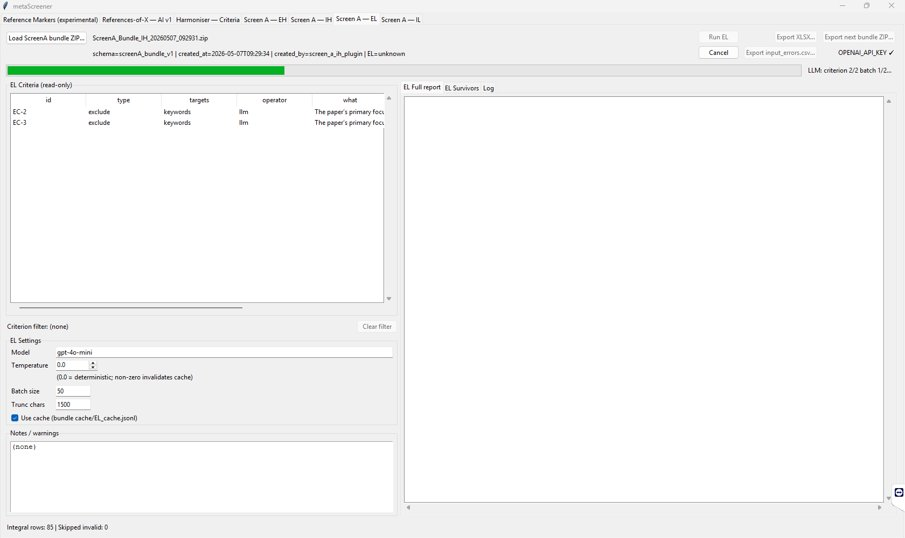
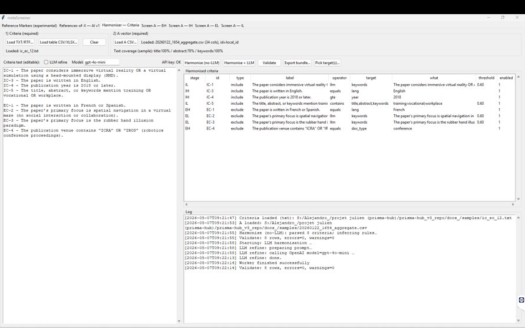
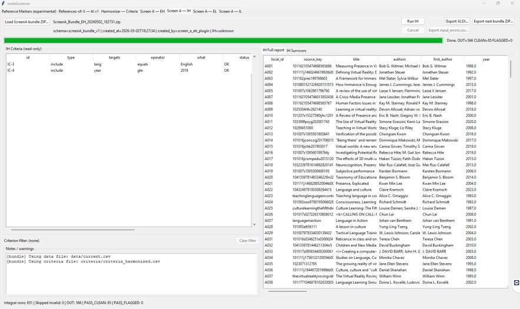

# Usage guide

This guide walks through running metaScreener end-to-end on the
sample corpus that ships with the repository — a pip install does
not include it; clone or download the source to follow along. After
installing the application (see the
[installation guide](installation.md)), launch the GUI with
`python run.py` from the project root; the main window opens with
the plugin list on the left and the bundle slot on the right.

The walkthrough below follows the seven plugins in pipeline order
(01 to 07) and uses the sample data in
[`samples/`](../samples/) as the running example. If you
have your own corpus and criteria, you can substitute them at the
appropriate step.

## Before you start

### Sample inputs

Three files live in `samples/`:

- **`ic_ec_12.txt`** — eight free-text criteria (four inclusion,
  four exclusion) for a systematic review on head-mounted-display
  virtual reality. This is the input to Plugin 03 (Criteria Parser).
- **`ex_ref_2.txt`** — a short bibliography rendered as numbered
  citations, used to demonstrate Plugin 01's behaviour on
  reference-marker images. Not directly relevant if you start with
  a structured citation list.
- **`20260122_1654_aggregate.csv`** — 776 candidate records in the
  metaScreener aggregate-CSV schema (title, authors, year, abstract,
  keywords, venue, DOI, etc.). This is the input to Plugin 02 when
  using a pre-existing record set, and the corpus on which the
  rest of the demonstration runs.

### The bundle pipeline in one paragraph

Each plugin reads a **bundle** (a ZIP archive containing the canonical
record table, the harmonized criteria, per-stage reports, and the LLM
response cache) and writes a new bundle to a location of your choice.
Plugin 01 and 02 are entry points - they create the initial bundle
from raw inputs. Plugin 03 attaches the structured criteria.
Plugins 04 through 07 filter the records using those criteria, each
producing an updated bundle with its decision reports appended. You
can save and resume between stages by checkpointing a bundle to disk.

### Configuration

Plugins 03 (with LLM refinement enabled), 06 and 07 need a **model
provider**, which metaScreener asks for on first launch and remembers;
see [Installation > Configuration](installation.md#configuration). A
local server — Ollama, LM Studio, llama.cpp, vLLM — needs **no API key**,
and `.env` is no longer the route for choosing one: a stored provider
choice takes precedence over `OPENAI_BASE_URL`. It does **not** take
precedence over `OPENAI_API_KEY` — if that variable is set it is still
handed to the SDK, whatever endpoint the stored choice resolves to, so a
leftover vendor key in your environment travels to your local server.
Unset it, or keep it out of the environment metaScreener runs in
(F-160). Plugin 01 is the
exception and does still require an OpenAI key in the environment: it
calls the vendor directly and is billed even when the screening stages
are set to a local model, which its own tab says in a banner. The
deterministic plugins (02, 04, 05) run without any provider but still
benefit from network access (Plugin 02) and an active venv (all of
them). The per-plugin model and temperature settings are exposed in
each plugin's UI panel; defaults are sensible for first use.

## Plugin walkthrough

### Plugin 01 - Reference Markers (experimental)

**Purpose.** Extracts visually-rendered reference markers (numbered
citations like `[1]`, `[Smith 2022]`) from image inputs (PDF or PNG)
into a structured citation list. This is an entry-point plugin: you
use it when starting from a PDF page rather than from a structured
database export.

**When to use.** Your source list of citations exists only as a
rendered image - typically a bibliography page exported from a
review article. Skip this plugin if you already have a structured
citation list (Endnote XML, BibTeX, RIS, CSV).

**Inputs.** A PDF file containing rendered citation markers, or a
PNG image of the same. The application accepts a single file per
run; if your bibliography spans multiple pages, run the plugin once
per page and concatenate the outputs in Plugin 02.

**What it produces.** A CSV with at minimum a `local_id` and a free-
text `raw_citation` field per detected marker. Subsequent enrichment
happens in Plugin 02.

**Common gotchas.**

- The plugin is designed for *reference-marker* images. PRISMA flow
  diagrams or methodology figures do not contain markers in the
  expected format and may produce hallucinated output. Verify by
  spot-checking a handful of outputs against the source image.
- Confidence is reported per marker but should not be treated as a
  guarantee. Plan a manual review of the Plugin 01 output before
  proceeding.
- A copyright-safe sample is not included in the repository; see
  the [sample data note](../samples/README.md) for guidance on
  preparing your own test image.

### Plugin 02 - References-of-X AI

**Purpose.** Resolves and enriches free-text or partial citations
against three bibliographic services (OpenAlex, Crossref, Semantic
Scholar) to produce a canonical aggregate record per citation, with
DOI/PMID/ArXiv identifiers, full abstract, keywords, venue, and
year.

**When to use.** You have a list of citations (from Plugin 01, from
a text file, or hand-pasted) that lacks structured metadata. The
output of Plugin 02 is the standard input to the rest of the
pipeline.

**Inputs.** Either a raw bibliography text file (like
`samples/ex_ref_2.txt`) or an existing aggregate CSV. The
plugin will pass through records that already have complete metadata
and only query the network for records that need enrichment.

**What it produces.** An aggregate CSV in the metaScreener
canonical schema (the same shape as
`samples/20260122_1654_aggregate.csv`). Provenance for each
field is recorded in the `field_sources` column, and a per-source
hit flag (`hit_openalex`, `hit_crossref`, `hit_semanticscholar`)
makes it easy to spot records that landed in only one database.

**Common gotchas.**

- Network access is mandatory. Records that fail to resolve in any
  of the three services are emitted with `status = "unresolved"`
  and require manual triage.
- Rate limits apply to OpenAlex and Crossref. The plugin paces
  requests automatically; on very large corpora, expect a few
  minutes of throughput-limited running time.
- Semantic Scholar is the most volatile of the three sources -
  endpoint availability fluctuates. The plugin marks records that
  failed only on Semantic Scholar separately so they can be
  retried later without re-querying the others.

### Plugin 03 - Criteria Parser


> *Figure: Plugin 03 (Criteria Parser / Harmoniser) after loading `samples/ic_ec_12.txt`. The left panel holds the editable free-text criteria; the right panel shows the inferred harmonised criteria table with stage and operator assignments per row. The log at the bottom records each step of parsing and the optional LLM refinement pass.*

**Purpose.** Converts free-text inclusion and exclusion criteria
into a structured, machine-executable criteria table that the
downstream plugins consume. The output is the `criteria_harmonized.csv`
file referenced throughout the bundle.

**When to use.** Once. You produce `criteria_harmonized.csv` at the
start of a review; subsequent runs against the same review reuse
it.

**Inputs.** A plain-text file with one criterion per line, optionally
prefixed by an `IC-` or `EC-` tag and a separator. The bundled
example (`samples/ic_ec_12.txt`) shows the expected format.

**What it produces.** A CSV with one row per criterion and columns
including:

- `id` (criterion identifier),
- `text` (the free-text statement),
- `type` (`include` or `exclusion`-equivalent `exclude`),
- `stage` (`EH` / `IH` for deterministic, `EL` / `IL` for LLM),
- `operator` (the implementation: `language`, `year`, `doc_type`,
  `venue`, `doi`, `keyword_in_text`, or `llm`),
- and any operator-specific arguments parsed from the text.

**Inferred assignments.** The parser uses six pattern detectors
(language, year threshold, document type, venue keywords, DOI
patterns, keyword-in-text) to assign each criterion to a
deterministic stage when it can; criteria that need semantic
interpretation are routed to the LLM stages (`EL` for exclusion,
`IL` for inclusion). On the sample input, the inference produces:

- IC-3 (English) -> `IH` / `language`,
- IC-4 (year >= 2018) -> `IH` / `year`,
- IC-5 (keywords) -> `IH` / `keyword_in_text`,
- EC-1 (French/Spanish) -> `EH` / `language`,
- EC-4 (venue contains ICRA or IROS) -> `EH` / `venue`,
- IC-1, EC-2, EC-3 -> `IL` / `EL` (the three LLM-adjudicated
  criteria evaluated in the
  [LLM validation study](llm-evaluation.md)).

**LLM refinement (optional).** A second pass can re-examine borderline
assignments under structural guardrails: the model may not change the
number of rows, and may not change any row's `id` or `type`. A row that
fails validation aborts the pass and the rule-based output stands.

> **Two corrections, both from wave 12.** This passage previously said
> the refined output "is annotated with the original and refined
> assignments so the researcher can audit any changes". **It is not.**
> `plugins/03_harmoniser/ui.py::HarmoniserView._harmonise_llm` assigns
> `self.state.rows = refined`, replacing the table wholesale; the
> previous assignments are not recorded anywhere and the change is not
> shown. Compare the criteria table before and after, or export first,
> if you need to audit the pass (F-158).
>
> This went unnoticed because **the pass could not run at all**. Until
> wave 12 it fell through to an SDK interface removed in `openai` 1.0
> and failed on every modern install with an error naming the wrong
> problem (F-146), so no user had ever seen its output. Treat the
> refinement as newly available rather than long-standing, and review
> its output rather than the description of it.

**Common gotchas.**

- Always review the parsed output before proceeding. Misclassified
  criteria propagate to every downstream stage.
- The parser is conservative: ambiguous criteria default to the LLM
  stages rather than being silently assigned to a heuristic.
- Edits to the harmonized CSV outside the GUI break bundle integrity
  hashes; if you need to manually correct an assignment, re-run
  Plugin 03 with the corrected text input rather than editing the
  CSV directly.

### Plugin 04 - EH (Exclusion by Heuristic)

**Purpose.** Removes records that match any deterministic exclusion
rule (language, document type, venue, etc.) before they reach the
LLM stages.

**When to use.** After Plugin 03 has produced the harmonized criteria
and after Plugin 02 has produced the aggregate CSV. EH and IH run in
either order, but EH-then-IH is the conventional sequence because
it gets the bulk of obvious exclusions out of the way first.

**Inputs.** The bundle from Plugin 02 (or from a checkpointed earlier
bundle) plus the harmonized criteria from Plugin 03.

**What it produces.** A bundle with the surviving records and a
two reports: `reports/EH_FULL.csv`, which lists every record with
the criteria that failed, were missing, or were met and a
reason summary (e.g., "Failed: EC-1"), and
`reports/EH_SURVIVORS.csv`, the records that continue to Plugin 05.

**A note on line endings inside metadata.** Record fields pass through to
the reports otherwise verbatim, with one deliberate canonicalisation: any
Windows (`CR LF`) or bare-`CR` line break *inside* a metadata value — a
multi-line abstract, for example — is rewritten to a plain `LF` when the
deterministic stages (04 and 05) read the corpus. The value stays a single
CSV field either way; only the flavour of its internal line breaks changes.
If you diff a report against your source corpus byte-for-byte, this is the
one expected difference.

**Common gotchas.**

- No LLM cost, no latency. If a record can be excluded by a
  deterministic rule, this is where it should be excluded.
- The per-criterion match counts at the top of the report are useful
  for sanity-checking: an EH rule that excludes 0 records is
  probably misconfigured (or, occasionally, just a no-op on this
  corpus).

### Plugin 05 - IH (Inclusion by Heuristic)


> *Figure: Plugin 05 (IH) after running on the post-EH bundle. The IH Criteria panel (top left) lists the deterministic inclusion rules that matched (IC-3 = language English, IC-4 = year ≥ 2018). The right panel previews the 566 surviving records; the status line reports `OUT: 566 CLEAN:85 FLAGGED:0`. All inclusion-pass records carry forward to Plugin 06.*

> *Provenance note (2026-08-14, wave 15a — F-168): the screenshots and
> counts on this page show the shipped demonstration, whose harmonisation
> rules were retired at wave 13d; the same criteria prose harmonised today
> gives `776 → 16 → 760 → 613 → 147` at this point in the pipeline. See
> `docs/data/study_input/study_input.meta.txt` for the full note.*

**Purpose.** Retains only records that match at least one
deterministic inclusion rule.

**When to use.** Immediately after Plugin 04. Like EH, IH is
zero-cost and zero-latency.

**Inputs.** The bundle from Plugin 04.

**What it produces.** A bundle with the records that satisfy at
least one inclusion rule, plus `reports/IH_FULL.csv`, showing for each record which rules it
matched, and `reports/IH_SURVIVORS.csv`, the records that continue
to Plugin 06.

**Common gotchas.**

- IH is "match at least one"; criteria are OR-combined. Be careful
  with overly permissive inclusion criteria - they will let too
  much through.
- Records that fail every IH criterion are excluded with `decision
  = NOT_MEET` in the report, with the full criterion list as
  evidence.

### Plugin 06 - EL (Exclusion by LLM)


> *Figure: Plugin 06 (EL) ready to run on the post-IH bundle. The EL Criteria panel (top left) shows the two LLM-adjudicated exclusion criteria (EC-2, EC-3, both with `operator = llm`). The EL Settings panel (lower left) exposes the model selector, the temperature (0.0 = deterministic; any non-zero value invalidates the response cache), the batch size, the truncation length applied to long abstracts, and the cache toggle. The top progress bar shows criterion 2/2 batch 1/2 in flight.*

**Purpose.** Applies LLM-based eligibility adjudication against the
exclusion criteria, using title, abstract, and keywords as evidence.

**When to use.** After EH and IH have removed records the
deterministic rules can decide. EL is the first stage to incur LLM
cost.

**Inputs.** The bundle from Plugin 05.

**Evidence gating.** A record is excluded by EL only when the LLM's
response includes both (1) a confidence score at or above the
configured threshold (default 0.6) and (2) a verbatim quotation
from the record's title, abstract, or keywords that triggers the
exclusion. Records that fail either condition are flagged for
human review rather than auto-excluded. The thresholds and the
human-review queue are visible in the plugin's UI panel.

**Flag-only, and it is the rule that decides removal on a local
provider.** Passing the gate is necessary for an exclusion and is no
longer sufficient. On a `local` or `custom` provider metaScreener runs
**flag-only** by default: a verdict that clears the gate marks the record
`EXCLUSION_SUPPRESSED` and the record **survives** to human review
instead of being removed. Exclusion is permitted by default only for
OpenAI, and the provider dialog can change it either way.

The reason is measured, not precautionary: the gate verifies that a
quoted span is *present*, not that it *supports the verdict*, and local
models on this project's own corpus produced 40, 43 and 4 exclusions —
every one of them past the gate — where the hosted baseline produced one
correct one. All but one per run were records the audited baseline kept,
and the four from `qwen2.5` were examined individually and are wrong. Two
runs of the same model in the same recorded configuration did not even
agree with each other.
See [LLM evaluation > Local models on this
corpus](llm-evaluation.md#local-models-on-this-corpus-a-direct-measurement).

**What it produces.** A bundle with the surviving records plus a
report (`reports/EL_FULL.csv`) containing per-criterion status
(`MET` = passes the screen, `FAILED` = excluded, `SUPPRESSED` = the
model asked for exclusion and flag-only did not act on it, `UNCERTAIN` =
no verdict could be acted on — the gate refused one, or the criterion is
not an LLM criterion at this stage, `MISSING` = the record has no text in
any field the criterion targets, so nothing could be judged), confidence,
and the quoted evidence. Five statuses, not four: `MISSING` is rare
enough that it appears in none of the committed artefacts, which is why
it went unnamed here for several releases.
`SUPPRESSED` and `UNCERTAIN` are deliberately distinct: the first means
the model was confident and was overruled, the second that it was not
confident enough to be acted on. The record-level `el_outcome` column
carries `EXCLUSION_SUPPRESSED` for the first case. The full
`el_evidence_json` column is also added to the canonical record
table for downstream use - this is the column from which the
[LLM validation study](llm-evaluation.md) computes agreement
metrics.

**Common gotchas.**

- Even with evidence gating, LLM-stage outputs should not be
  trusted blindly. The
  [LLM-screening human validation document](llm-evaluation.md)
  describes the methodology for measuring how well the LLM's
  decisions track human judgement and provides reference kappa
  values on the demonstration corpus.
- The cache makes re-running cheap: a second run on the same input
  with the same model and prompt version reuses the cached
  responses and incurs no API cost.
- `UNCERTAIN` records carry forward to the next stage; they are
  not lost.

### Plugin 07 - IL (Inclusion by LLM)

**Purpose.** Applies LLM-based eligibility adjudication against the
inclusion criteria. Same evidence-gating regime as EL.

**When to use.** After EL. IL is typically the last filter before
the manual full-text review queue.

**Inputs.** The bundle from Plugin 06.

**What it produces.** A bundle with the records that survive the
inclusion criteria, plus the same shape of decision report and an
`il_evidence_json` column on the record table.

Flag-only applies here too, and the polarity is worth stating because it
is easy to get backwards. IL's criteria are *inclusion* criteria, so the
verdict that removes a record is `not_meet` — the model saying the record
does **not** satisfy the criterion. Under flag-only that verdict is
recorded as `EXCLUSION_SUPPRESSED` and the record survives, exactly as an
EL `meet` verdict does. The mirror image of the verdict; the same action
declined.

**Common gotchas.** Identical to EL's: trust the cache, do not trust
unverified outputs, treat `UNCERTAIN` as "human review needed" not
as "default to exclude". The validation methodology and reference
numbers in the
[LLM-screening human validation document](llm-evaluation.md) apply
equally to IL.

## Re-running and the LLM cache

Every LLM response in metaScreener is keyed by the SHA-256 hash of
(record content, prompt version, model identifier, criterion
identifier). On a second run with identical inputs, the cache
returns the stored response and the API is not contacted. This has
three practical implications:

- **Cost predictability.** Only the records that survive the
  deterministic stages reach the LLM. On the demonstration corpus
  that is 85 records at EL and 84 at IL — 254 individual decisions in
  total (under the shipped pre-13d rules; today's rules send 147 to EL —
  see the provenance note above), which at the hosted default batch size of 50 is a handful of API
  requests, not thousands. Subsequent runs use zero. (Selecting a local
  provider offers a batch size of 5 instead, which is more requests to a
  server that charges nothing for them; it does not change the number of
  decisions, and it does not invalidate the cache.)
- **Reproducibility.** Bundles produced from a cached run are
  byte-identical (modulo the timestamps in `manifest.json`).
- **Debugging.** To re-run a stage's decisions after editing a
  prompt or a criterion, untick **Use cache** for that run. Editing
  the criterion is itself sufficient: the key covers the whole
  rendered prompt, so changed wording no longer matches a stored
  entry.

The cache is not a directory on disk. It travels **inside the
bundle**, as `cache/EL_cache.jsonl` and `cache/IL_cache.jsonl`, which
is why a bundle handed to a colleague carries its own decisions with
it. Each line is a JSON object with an opaque `key` and the stored
`val`; the key is a SHA-256 digest of the fully rendered prompt
together with the model, the resolved endpoint, the temperature and
the prompt version, so there is no per-record identifier in the file
to search on.

One content note before sharing or archiving a bundle: since the
no-answer instrumentation was added, `manifest.json` can carry up to
about 10 KB of **model output** — a bounded sample of what the model
sent back for records it did not answer. A model reply routinely
quotes the record it was shown, so those samples can contain fragments
of titles, abstracts or keyword strings. Nothing appears there that is
not already in the same bundle's own record files, but a manifest
extracted and passed around **on its own** now carries third-party
bibliographic text that older manifests did not. If you share bare
manifests rather than whole bundles, that is the field to check.

## The context window

Every request an EL or IL run sends has to fit inside the model
server's **context window** — the number of tokens the server will
read in one request. What happens when a request does not fit was
measured on a local server: the server does not trim the excess and
does not refuse. It keeps only enough of the request's tail to fill
half the window — the last ~2,048 tokens at the default window,
however long the request was — and drops everything before that.
The instructions and the criterion are at the front, so they are
what gets dropped, and the model then answers about the remainder.
No error and no flag marks the reply; only the token count in its
`usage` field betrays what happened, if you compare it with what
you sent.

So metaScreener sizes every request an EL or IL run would send
*before* the first one goes out, against the configured window. If
the largest request does not fit, the run stops before anything is
sent. When a smaller batch would fit your corpus, the message names
it, and **lowering the batch size** to that number is the quickest
remedy; when even a single record's request cannot fit, the message
says that instead, and lowering the truncation limit is the lever
that changes it. The other remedy, in either case, is **a larger
window** — as follows. (Not every model call is covered: Plugin
01's vendor calls and the criteria harmoniser's one refinement call
in Plugin 03 are sent without this check.)

**The server comes first.** The window metaScreener checks against
is a setting, described below — and the setting only tells
metaScreener what to refuse against. It does not change what the
server actually serves, so raising the setting without raising the
server trades a stated refusal for the silent truncation described
above. Raise the server's window, then record it in the setting.

**The server (Ollama).** There is no per-request way to ask for a
larger window through the OpenAI-compatible endpoint metaScreener
uses — the request fields that should carry it are silently ignored
(measured). The window is a property of the running server, set
when it starts: set the environment variable, for example

```text
OLLAMA_CONTEXT_LENGTH=8192
```

in the environment the Ollama server starts from, and restart it.
That example is the measured instance, not a recommendation: after
such a restart, a request of about 7,000 tokens was reported by the
server as processed in full (`usage.prompt_tokens = 7047`), where
the default window keeps only the last ~2,048.

**Hosted and other servers.** The check applies to every provider,
and the default window is the *local* server's measured default — a
hosted model's real window is generally far larger. For a hosted
endpoint there is no server of yours to restart: the remedy is the
setting alone, set to the context length your model's documentation
states. Other local servers (LM Studio, llama.cpp, vLLM) have their
own window flags; whatever the server, the rule is the same — the
setting must never exceed what the server actually serves.

**The setting.** `context_window`, application-level, default
**4096** — the serving window measured on this project's reference
Ollama out of the box. Ollama chooses that default from the
machine's hardware, so a different machine can serve a different
window; the default here is the measured one, not a promise. There
is no GUI field for the setting; it lives in the settings file
(`%APPDATA%\metaScreener\settings.json` on Windows;
`$XDG_CONFIG_HOME/metaScreener/settings.json` if that variable is
set, `~/.config/metaScreener/settings.json` otherwise). The file
already carries the key as `null`, which means "use the default";
replace the `null` with your number:

```json
"context_window": 8192
```

— an example, matching the restart above, not a recommendation.
The value must be a bare number, not a quoted string (a quoted
value parses and is silently ignored), and values below 512 are
treated as absent.

**The ceiling.** A window cannot exceed what the model was built
for. The first model metaScreener offers to download
(`qwen2.5:7b-instruct-q4_K_M`) declares an architectural maximum of
**32,768** tokens in the metadata of the snapshot measured here;
asking for more than a model's maximum cannot give you more than
the model has.

**The cost.** A larger window makes the server reserve more memory
for its attention cache, whether or not a request fills it. On a
machine where the model plus that cache no longer fit in GPU
memory, part of the work moves to the CPU and every call slows
down — how much, and whether it matters, depends on your hardware,
your corpus and your batch size, which is why metaScreener does not
raise the window for you and does not recommend a value. The
default stays the measured server default; the remedies above are
yours to choose between.

## Exporting and final outputs

The final bundle from Plugin 07 contains the surviving records (in
the demonstration: 73 from 776, a 90.6% reduction — figures of the
shipped pre-13d demonstration; see the provenance note earlier on this
page). Two export
options are available from the bundle slot in the GUI:

- **Canonical CSV** - the record table only, ready for use in
  reference managers (Zotero, EndNote) or for handoff to the full-
  text review stage.
- **Full bundle ZIP** - the complete pipeline state, including
  every per-stage report and the response cache. Use this if you
  want to archive the run for reproducibility or hand it off to a
  collaborator who will continue from a specific stage.

The per-stage `*_FULL.csv` reports carry the counts needed to fill
in a PRISMA flow diagram (records screened, excluded, and retained
at each stage), but metaScreener does not draw one for you - the
diagram has to be produced separately.

## What's next

- For the methodology behind the LLM stages' agreement with human
  judgement (Reviewer 1's compulsory item in the JORS revision),
  see [LLM-screening human validation](llm-evaluation.md).
- For common-question answers, see the [FAQ](faq.md).
- For pipeline architecture diagrams and the bundle-format
  specification, see the [README](../README.md).
